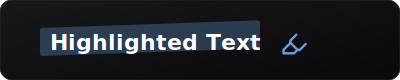

# React Animated Highlighter

An animated text highlighter component for React with smooth GSAP animations. Perfect for hero sections, landing pages, and attention-grabbing text effects.



[](https://www.npmjs.com/package/react-animated-highlighter)
[](https://ko-fi.com/xBenJamminx)

## Features

- Smooth GSAP-powered animations
- Highlighter icon that "draws" across your text
- Fully customizable colors, timing, and opacity
- Replay animation on hover option
- TypeScript support
- Zero external icon dependencies

## Installation

```bash
npm install react-animated-highlighter gsap
```

## Quick Start

```tsx
import { AnimatedHighlighter } from 'react-animated-highlighter';

function App() {
  return (
    <h1>
      Welcome to <AnimatedHighlighter text="My Website" />
    </h1>
  );
}
```

## Props

| Prop | Type | Default | Description |
|------|------|---------|-------------|
| `text` | `string` | **required** | The text to highlight |
| `color` | `string` | `'#6ca0dc'` | Highlight color |
| `fontSize` | `string` | `'30px'` | Font size of the text |
| `className` | `string` | `''` | Additional CSS class |
| `showIcon` | `boolean` | `true` | Show the highlighter icon during animation |
| `highlightOpacity` | `number` | `0.3` | Opacity of the highlight (0-1) |
| `duration` | `number` | `1.5` | Animation duration in seconds |
| `delay` | `number` | `0` | Delay before animation starts |
| `replayOnHover` | `boolean` | `false` | Replay the animation on hover |

## Examples

### Custom Color

```tsx
<AnimatedHighlighter
  text="Important!"
  color="#f59e0b"
/>
```

### Slower Animation

```tsx
<AnimatedHighlighter
  text="Take your time"
  duration={3}
  delay={0.5}
/>
```

### No Icon, Just Highlight

```tsx
<AnimatedHighlighter
  text="Subtle highlight"
  showIcon={false}
  highlightOpacity={0.2}
/>
```

### Interactive (Replay on Hover)

```tsx
<AnimatedHighlighter
  text="Hover me!"
  replayOnHover={true}
/>
```

### Hero Section Example

```tsx
<h1 className="text-5xl font-bold">
  Ship products with{' '}
  <AnimatedHighlighter
    text="zero friction"
    color="#10b981"
    fontSize="inherit"
    duration={2}
  />
</h1>
```

## Color Ideas

| Color | Hex | Use Case |
|-------|-----|----------|
| Blue | `#6ca0dc` | Default, professional |
| Emerald | `#10b981` | Success, growth |
| Amber | `#f59e0b` | Warning, attention |
| Rose | `#f43f5e` | Important, urgent |
| Purple | `#8b5cf6` | Creative, premium |

## Requirements

- React 17+
- GSAP 3+ (peer dependency)

## AI Assistant Integration

This package includes a `CLAUDE.md` file with detailed instructions for AI coding assistants (Claude, GPT, Copilot, etc.). When you ask an AI to integrate this package into your project, it can read these instructions to provide accurate, copy-paste ready code.

The AI instructions cover:
- Quick setup examples
- All props with descriptions
- Integration with Framer Motion
- Recommended color palettes
- Common patterns for hero sections, landing pages, etc.

## License

MIT © Ben Jammin
